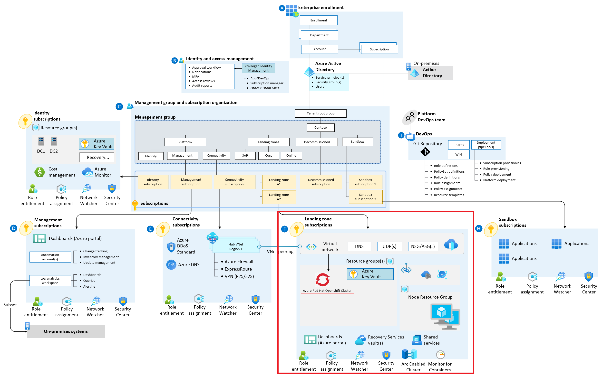

# ARO Landing Zone Accelerator

Azure Landing Zone Accelerators are architectural guidance, reference architecture, reference implementations and automation packaged to deploy workload platforms on Azure at Scale and aligned with industry proven practices.

ARO Landing Zone Accelerator represents the strategic design path and target technical state for an Azure Red Hat Openshift (ARO) deployment. This solution provides an architectural approach and reference implementation to prepare landing zone subscriptions for a scalable ARO cluster. For the architectural guidance, check out [ARO Landing Zone Accelerator](https://docs.microsoft.com/en-us/azure/cloud-adoption-framework/scenarios/app-platform/azure-red-hat-openshift/landing-zone-accelerator) in Microsoft Docs.

The ARO Landing Zone Accelerator is only concerned with what gets deployed in the landing zone subscription highlighted by the red box in the picture above. It is assumed that an appropriate platform foundation is already setup which may or may not be the [official Azure Landing Zones](https://docs.microsoft.com/azure/cloud-adoption-framework/ready/enterprise-scale/architecture) platform foundation. This means that policies and governance should already be in place or should be setup after this implementation and are not a part of the scope this reference implementaion. The policies applied to management groups in the hierarchy above the subscription will trickle down to the ARO Landing Zone Accelerator landing zone subscription.

## Next steps
### Follow a scenario driven tutorial within this repo

Follow the steps in the Secure baseline scenario to deploy your first ARO landing zone accelerator

:arrow_forward: [ARO Secure Baseline](./Scenarios/Secure-Baseline)