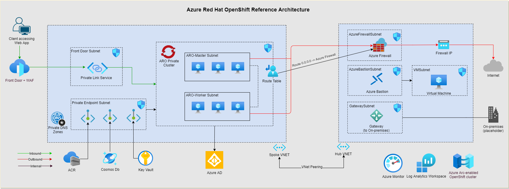

# ARO Reference Architecture

This repo is for building Azure Red Hat OpenShift reference architecture and to integrate with other Azure Service

Currently we’ve no reference architectures in Azure Architecture Center for deploying Azure Red Hat OpenShift (ARO) and integrating with various Azure Services. This has been a pain point for customers looking to deploy ARO following Microsoft recommended best practices and continue to hinder ARO adoption.

Goal of this hackathon project is to come up with Reference Architecture/Reference Implementation to deploy following services:

- Private ARO cluster deployed across AZs
- Integrate with Azure AD for RBAC
- Azure Front Door + Web Application Firewall with Private Link Service to connect private IP address in ARO
- Azure Firewall for securing outbound traffic
- Azure Container Registry for storing container images in geo-replicated manner
- Azure Key Vault for storing secretes/certificates in a centralized manner
- Azure Cosmos DB with private endpoint for application backend
- Connect ARO cluster to Azure Arc and install Container Insights extension for collecting logs through Log Analytics workspace
- Provision Azure Bastion Host & Jumpbox VM to securely connect to ARO cluster and deploy a sample application manually
