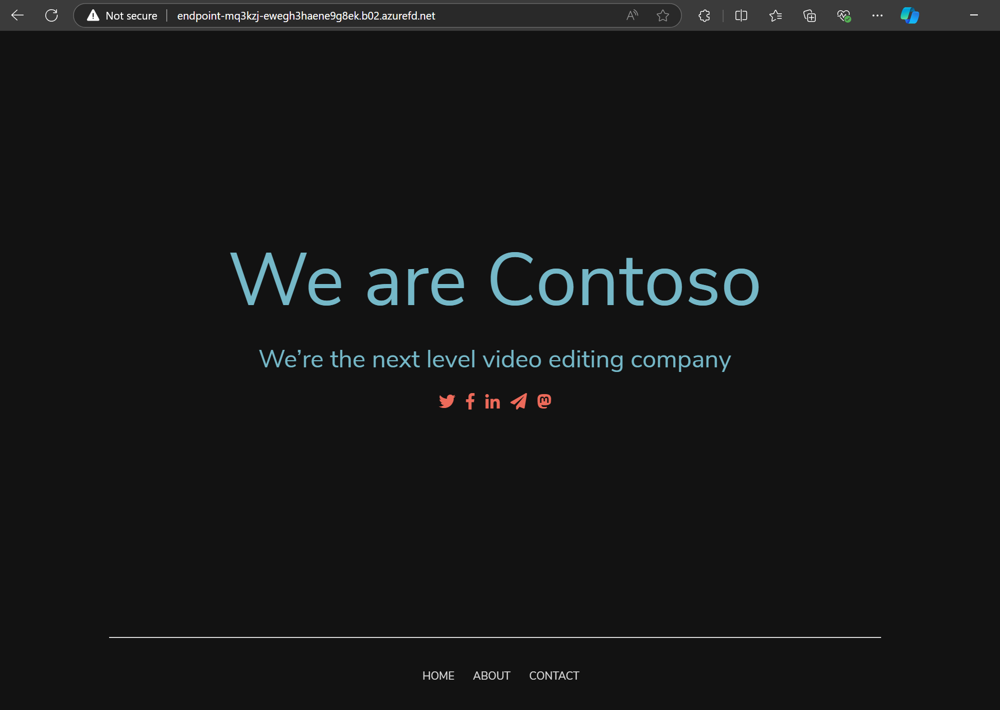
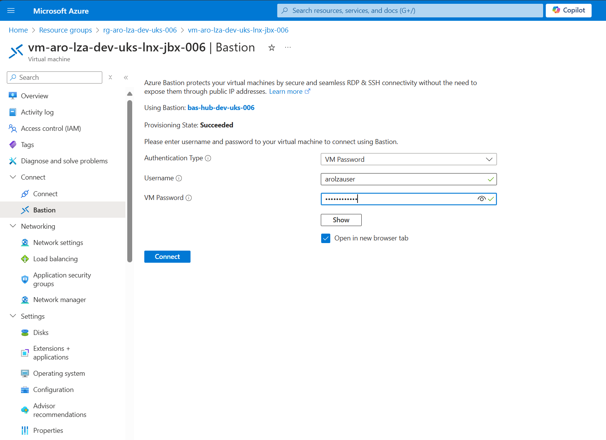

# ARO Secure Baseline - ARO Cluster Deployment Guide (Bicep - AVM)

This guide provides comprehensive instructions for deploying a sample application to your Azure Red Hat OpenShift (ARO) cluster. We'll be using the [Contoso Website](https://github.com/MicrosoftDocs/mslearn-aks-deploy-container-app) from the Microsoft Container Registry as our sample application.



## Deployment Process

### Step 1: Access Your Jumpbox VM

Within your spoke resource group, you'll find two jumpbox VMs: one Windows-based and one Linux-based. For this guide, we'll utilize the Linux VM, as it comes pre-configured with the necessary packages.

To access the Linux jumpbox VM:

1. Navigate to the [Azure Portal](https://portal.azure.com/#home).
2. Locate your spoke resource group.
3. Find the Linux jumpbox VM within the resource group.
4. Use Azure Bastion for secure VM access. If you've used default deployment values, the credentials will be:
   - Username: `arolzauser`
   - Password: `P@ssw0rd1234`



### Step 2: Application Deployment

Once you've accessed the jumpbox terminal, follow these steps to deploy the application:

1. Authenticate with Azure CLI:
   ```bash
   az login
   ```
   Follow the prompts to complete the authentication process.

2. Set your spoke resource group name as an environment variable:
   ```bash
   export SPOKE_RG_NAME=<your-spoke-resource-group-name>
   ```

3. Retrieve ARO cluster information and credentials:
   ```bash
   SPOKE_RG_NAME=$SPOKE_RG_NAME
   AROCLUSTER=$(az aro list -g $SPOKE_RG_NAME --query "[0].name" -o tsv)
   LOCATION=$(az aro show -g $SPOKE_RG_NAME -n $AROCLUSTER --query location -o tsv)
   apiServer=$(az aro show -g $SPOKE_RG_NAME -n $AROCLUSTER --query apiserverProfile.url -o tsv)
   webConsole=$(az aro show -g $SPOKE_RG_NAME -n $AROCLUSTER --query consoleProfile.url -o tsv)
   # Log in to ARO cluster
   kubeadmin_password=$(az aro list-credentials --name $AROCLUSTER --resource-group $SPOKE_RG_NAME --query kubeadminPassword --output tsv)
   oc login $apiServer -u kubeadmin -p $kubeadmin_password
   ```

4. Create a new project for the application:
   ```bash
   oc new-project contoso
   ```

5. Add the necessary security context constraint:
   ```bash
   oc adm policy add-scc-to-user anyuid -z default
   ```
   This command allows the pod to run as root, which is required for the NGINX-based Contoso Website application. It's important to note that running containers as root should generally be avoided for security reasons, but it's necessary in this case due to the application's requirements.

6. Deploy the application components:

   a. Create the Deployment:
   ```bash
   cat <<EOF | oc apply -f -
   apiVersion: apps/v1
   kind: Deployment
   metadata:
     name: contoso-website
     namespace: contoso
   spec:
     selector:
       matchLabels:
         app: contoso-website
     template:
       metadata:
         labels:
           app: contoso-website
       spec:
         containers:
         - name: contoso-website
           image: mcr.microsoft.com/mslearn/samples/contoso-website
           resources:
             requests:
               cpu: 100m
               memory: 128Mi
             limits:
               cpu: 250m
               memory: 256Mi
           ports:
           - containerPort: 80
             name: http
         securityContext:
           runAsUser: 0
           fsGroup: 0
   EOF
   ```
   The Deployment manages the desired state of your application, ensuring the specified number of pod replicas are running.

   b. Create the Service:
   ```bash
   cat <<EOF | oc apply -f -
   apiVersion: v1
   kind: Service
   metadata:
     name: contoso-service
     namespace: contoso
   spec:
     ports:
       - port: 80
         protocol: TCP
         targetPort: http
         name: http
     selector:
       app: contoso-website
     type: ClusterIP
   EOF
   ```
   The Service provides a stable internal IP address and DNS name for the application, allowing other components within the cluster to access it.

   c. Create the Ingress:
   ```bash
   cat <<EOF | oc apply -f -
   apiVersion: networking.k8s.io/v1
   kind: Ingress
   metadata:
     name: contoso-ingress
     namespace: contoso
   spec:
     rules:
       - host: $FRONT_DOOR_FQDN
         http:
           paths:
             - path: /
               pathType: Prefix
               backend:
                 service:
                   name: contoso-service
                   port:
                     number: 80
   EOF
   ```
   The Ingress configures external access to the application, routing traffic from the Azure Front Door FQDN to the appropriate service within the cluster.

After completing these steps, your application will be accessible via the Azure Front Door FQDN endpoint. This setup provides a scalable, load-balanced, and externally-accessible deployment of the Contoso Website application on your ARO cluster.