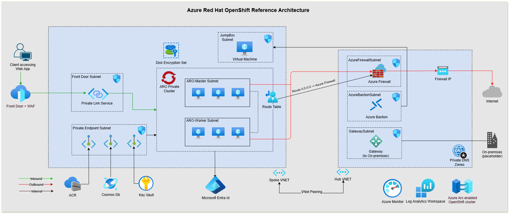

# ARO Secure Baseline - Bicep with Azure Verified Modules (AVM)

> [!CAUTION]
> **THIS IMPLEMENTATION IS IN PROGRESS.**

These [Bicep templates](#bicep-templates) are designed to deploy a secure baseline [Azure Red Hat OpenShift (ARO)](https://learn.microsoft.com/azure/openshift/) cluster. This deployment is based on the [Azure Red Hat OpenShift Landing Zone Accelerator](https://docs.microsoft.com/en-us/azure/cloud-adoption-framework/scenarios/app-platform/azure-red-hat-openshift/landing-zone-accelerator) documentation.

A deployment of ARO-hosted workloads typically requires a separation of duties and lifecycle management in different areas, such as prerequisites, the host network, cluster infrastructure, the shared services, and the application workloads themselves. This reference implementation is no different. Also, be aware that our primary purpose is to illustrate the topology and decisions involved in the deployment of an ARO cluster. We feel a "step-by-step" flow will help you learn the pieces of the solution and will give you insight into the relationship between them. Ultimately, lifecycle/SDLC management of your cluster and its dependencies will depend on your situation (organizational structures, standards, processes and tools), and will be implemented as appropriate for your needs.

There are various ways to secure your ARO cluster. From a network security perspective, these can be classified into securing the control plane and securing the workload. When it comes to securing the control plane, one of the best ways to do that is by using a private cluster, where the control plane or API server has internal IP addresses that are defined in the [RFC1918 - Address Allocation for Private Internet](https://datatracker.ietf.org/doc/html/rfc1918) document. By using a private cluster, you can ensure network traffic between your API server and your node pools remains on the private network only.

This reference architecture is designed to deploy a secure baseline ARO cluster following the [Hub and Spoke network topology](https://learn.microsoft.com/en-us/azure/cloud-adoption-framework/ready/azure-best-practices/hub-spoke-network-topology). The complete architecture is illustrated in the diagram below:



This landinxg zone accelertor provides end-to-end [Bicep templates](#bicep-templates) that are composed mainly of [Azure Verified Modules (AVM)](https://azure.github.io/Azure-Verified-Modules/). AVM is an initiative ti consolidate and set the standards for what a good Infrastructure as Code (IaC) module should look like. These templates are divided into six main components that are descibed in the [Core Architecture Components](#core-architecture-components) section below. When you deploy these templates, you will have a secure ARO cluster that is compliant with the ARO landing zone accelerator guidance and best practices. Optionally, you can also deploy a workload known as the Ratings app that is also featured in the [Azure Kubernetes Services Workshop](https://docs.microsoft.com/en-us/learn/modules/aks-workshop/). Adapt, update, and extend these templates to meet your specific requirements. They are designed to be a starting point for your own implementation and to accelerate your deployment of a secure ARO cluster. Review carefully and modify them to meet your own requirements.

## Core Architecture Components

The core architecture components of this reference implementation are divides in 6 main modules as follows (cf. the diagram above):

1. [Hub](./01-Hub/README.md): this module is the central point of connectivity to the on-premises network and the internet. An example of a hub is provided with this template. However we recommend that you bring your own hub to this deployment.
    - Hub resource group: contains all the hub resources.
    - Hub virtual network: the central point of connectivity to the on-premises network and the internet.
    - Azure Bastion: host used to provide secure RDP and SSH connectivity to the virtual machines in the spoke virtual networks
    - Azure Firewall: used to protect the hub virtual network and its peered networks from unwanted traffic.
    - Private DNS Zone: used to resolve the private IP addresses of the Azure Key Vault and the Azure Container Registry. The template is modular enough to let you choose if Private DNS Zones are part of the Hub or the Spoke.
    - Log Analytics Workspace: used to collect log data centrally.
2. [Spoke](./02-Spoke/README.md): this module is used build the foundation for the spoke in which the ARO cluster will be deployed.
    - Spoek resource group: contains all the spoke resources.
    - Spoke virtual network: the virtual network where the ARO cluster is deployed.
        - Master Node Subnet: used to deploy the master nodes of the ARO cluster. It cannot present a Network Security Group (NSG) as it is not yet supported by ARO.
        - Worker Node Subnet: used to deploy the worker nodes of the ARO cluster. It cannot present a Network Security Group (NSG) as it is not yet supported by ARO.
        - Private Endpoints Subnet: used to deploy the private endpoints for all supporting services like the Azure Container Registry and the Azure Key Vault.
        - Jumpbox Subnet: used to deploy the jumpbox virtual machines that are used to access the control plane of the ARO cluster.
    - Network Peering: used to connect the spoke virtual network to the hub virtual network.
    - Route Table: used to control the routing of egrees traffic from ARO subnets to the Azure Firewall.
    - Link private DNS Zone: used to resolve the private IP addresses of the Azure Key Vault and the Azure Container Registry.
3. [Supporting Services](./03-Supporting-Services/README.md): this module is used to deploy the supporting services that the ARO cluster will need.
    - Azure Key Vault: used to store and manage sensitive information such as secrets, keys, and certificates.
    - Disk Encryption Set: used to encrypt the disks of the virtual machines in the ARO cluster with Customer Managed Key (CMK).
    - Azure Container Registry: used to store and manage container images for the ARO cluster.
    - Jumpbox VMs: used to access the control plane of the ARO cluster.
4. [ARO Cluster](./04-ARO/README.md): this module is used to deploy the ARO cluster.
    - Azure Red Hat OpenShift: fully managed Openshift cluster that is monitored and operated jointly by Microsoft and Red Hat that is by default deployed with Disk Encryption Set and encryption at host.
    - Role Assignments: used to assign the necessary roles to the ARO cluster.
5. [Workload](./05-Workload/README.md): this module is used to deploy the Ratings app workload.
6. [Azure Front Door](./06-AFD/README.md): this module is used to deploy the Azure Front Door that will be used to route traffic to the ARO cluster.

> [!NOTE]
> When using a private cluster, the control plane can only be accessed from virtual machines (Jumbox) that are in the same virtual network as the control plane or a peered virtual network. For this reason, in this reference implementation, you are able to deploy two jumpbox VMs in the spoke virtual network that is peered with the ARO virtual network. This is to ensure that you can access the control plane from the jumpbox VMs using Bastion Host deployed in the hub virtual network.
>
> For CI/CD pipelines, you can create a separated subnet in the spoke virtual network and deploy the CI/CD agents there. This is similar to the jumpbox subnet

## Quick Start

To deploy the ARO cluster using Bicep with Azure Verified Modules (AVM) easily we provide a script that will deploy this landing zone accelerator for you. Adapt the script to your needs. The script uses the `bicepparam` files to pass the parameters to the Bicep templates. A step by step guide is available in the [Step-by-Step Guide](#step-by-step-guide) section below.

These are the main parameters for the scripts:

- `HUB_WORKLOAD_NAME`: the name of the hub workload. Default is `hub`.
- `SPOKE_WORKLOAD_NAME`: the name of the spoke workload. Default is `spoke`.
- `ENVIRONMENT`: the environment name. Default is `DEV`. Allowed values are `DEV`, `TST`, `UAT`, `PRD`.
- `LOCATION`: the Azure region where the resources will be deployed. Default is `eastus`.
- `HASH`: a unique hash to append to the resource names. This hash is optional. If not set, it won't be appended to the resource names. This is useful when you want to deploy multiple environments in the same subscription with the same name like for blue-green deployments.

Use the following command to deploy the ARO cluster:

```bash
source ./deploy.sh
```

## Bicep Templates

The Bicep templates are organized in the same structure as the [Core Architecture Components](#core-architecture-components) described above. Each module has its own Bicep template and parameters file. The main Bicep template is the `main.bicep` file that calls all the other custom modules and AVM modules. The `main.bicep` file is the entry point for the deployment. Each module is documented in its own `README.md` file.

### Parameters

The parameters files are used to pass the parameters to the Bicep templates. The parameters files are named `main.bicepparam` and contains only required parameters for the deployment. Each module contains a `README.md` file that describes the module and all its parameters. To know available parameters for each module, please refer to the `README.md` or use completion in Visual Studio Code. To know more about `bicepparam` files, please refer to the [Bicep documentation](https://learn.microsoft.com/en-us/azure/azure-resource-manager/bicep/parameter-files?tabs=Bicep).

### Functions and types

The Bicep templates use functions and types to simplify the code and make it more readable. The functions and types are defined in the `functions.bicep` and `types.bicep` files. They are organized as sub-modules in the `modules` folder. Each `main.bicep` file contains an `include` statement at the begining of the template to include the required functions and types.

All sub-modules that are common to multiple modules are placed in the `common-modules` folder. The `common-modules` folder contains the following sub-modules:

- `naming`: used to generate the names of the resources.
- `network`: used to define the network types like the subnet type.

### Naming

The naming convention used in this reference implementation is based on the [Azure Naming Convention](https://learn.microsoft.com/en-us/azure/cloud-adoption-framework/ready/azure-best-practices/resource-naming). The naming convention is defined in the `naming.bicep` file. This provide you a single place to update the naming convention to meet your requirements.

The naming convention is based on the following rules: `<resource-type-abbreviation>-<workload-name>-<lower-case-environment>-<short-location>-<unique-hash>`:

- `<resource-type-abbreviation>`: the resource type abbreviation. These abbreviations are defined in JSON files `common-modules\naming\abbreviations.json`.
- `<workload-name>`: the workload or the application name. The workload name is limited to 15 characters with a minimum of 3 characters. The workload paramater is by default `hub` for the hub and `aro-lza` for the spoke. The workload name paramater is `workloadName`.
- `<lower-case-environment>`: the environment name in lower case. The environment is limited to 3 characters. It can be `DEV`, `TST`, `UAT`, or `The environment paramater is `env`.`. The environment paramater is `env`.
- `<short-location>`: the short location name. The short location name is defined in JSON files `common-modules\naming\locations.json`. It takes as default vaule the location of the deployment for `subscription` scope template and the location of the resource group for `resourceGroup` scope template. The location paramater is `location`.
- `unique-hash`: a unique hash to append to the resource names. This hash is optional. If not set, it won't be appended to the resource names. This is useful when you want to deploy multiple environments in the same subscription with the same name like for blue-green deployments. The hash is limited to 5 characters with a minimum of 3 characters. The hash paramater is `hash`.

The type of resource and the type of location are defined in the `types.bicep` file.

## Step-by-Step Guide

This step-by-step guide will help you deploy a secure baseline ARO cluster using Bicep with Azure Verified Modules (AVM). Before starting the deployment, make sure you have the following prerequisites. These are the steps to deploy the ARO cluster:

0. [Prerequisites](#prerequisites)
1. [Hub](./01-Hub/README.md)
2. [Spoke](./02-Spoke/README.md)
3. [Supporting Services](./03-SupportingServices/README.md)
4. [ARO Cluster](./04-AROCluster/README.md)
5. [Workload](./05-Workload/README.md)
6. [Azure Front Door](./06-FrontDoor/README.md)

### Prerequisites

Before you start the deployment, make sure you fulfill the following prerequisites:

1. Have an Azure subscription. If you don't have an Azure subscription, create a [free account](https://azure.microsoft.com/free/) before you begin.
2. Create a `GitHub CodeSpace`, start a `Dev Container` or install the following tools on your local machine:
    - [Azure CLI](https://docs.microsoft.com/en-us/cli/azure/install-azure-cli) 2.47.0 or newer
    - [Bicep CLI](https://learn.microsoft.com/en-us/azure/azure-resource-manager/bicep/install) 0.18.4 or newer 
    - [Git](https://git-scm.com/downloads)
3. Register the following providers:

    ```bash
    az provider register --namespace 'Microsoft.RedHatOpenShift' --wait
    az provider register --namespace 'Microsoft.Compute' --wait
    az provider register --namespace 'Microsoft.Storage' --wait
    az provider register --namespace 'Microsoft.Authorization' --wait
    ```

4. If you are using encryption at host, register the following feature:

    ```bash
    az feature registration create --name EncryptionAtHost --namespace Microsoft.Compute
    ```

5. Login to your Azure account:

    ```bash
    az login
    ```

6. Clone this repository to your local machine:

    ```bash
    git clone https://github.com/Azure/ARO-Landing-Zone-Accelerator.git
    ```

### Next Step

:arrow_forward: [Hub](./01-Hub/README.md)
