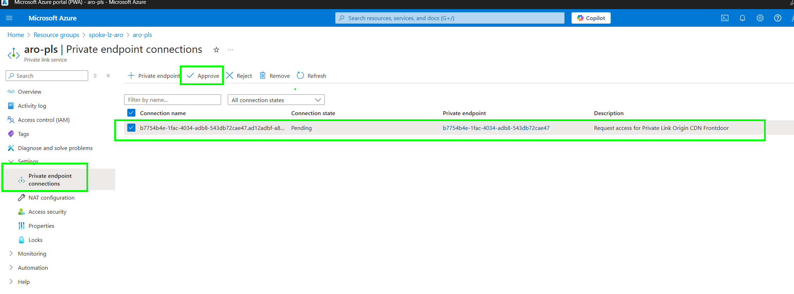

# Terraform Deployment


A deployment of ARO-hosted workloads typically requires a separation of duties and lifecycle management in different areas, such as prerequisites, the host network, cluster infrastructure, the shared services, and the application workloads themselves. This reference implementation is no different.

There are various ways to secure your ARO cluster. From a network security perspective, these can be classified into securing the control plane and securing the workload. When it comes to securing the control plane, one of the best ways to do that is by using a private cluster, where the control plane or API server has internal IP addresses that are defined in the [RFC1918 - Address Allocation for Private Internet](https://datatracker.ietf.org/doc/html/rfc1918) document. By using a private cluster, you can ensure network traffic between your API server and your node pools remains on the private network only.

This reference architecture is designed to deploy a secure baseline ARO cluster following the [Hub and Spoke network topology](https://learn.microsoft.com/en-us/azure/cloud-adoption-framework/ready/azure-best-practices/hub-spoke-network-topology). The complete architecture is illustrated in the diagram below:


## Core Architecture Components

This Terraform deployment will deploy a secure baseline Azure RedHat Openshift (ARO) cluster. This deployment is based on the [Azure Red Hat OpenShift Landing Zone Accelerator](https://docs.microsoft.com/en-us/azure/cloud-adoption-framework/scenarios/app-platform/azure-red-hat-openshift/landing-zone-accelerator) documentation. There is a [single Terraform deployment](main.tf) that will deploy the following:

- Hub and Spoke Network Topology
- Hub resource group with the following resources:
  - [Log Analytics Workspace](main.tf) used to collect log data centrally.
  - [Azure Firewall](modules/vnet/firewall.tf) used to protect the hub virtual network and its peered networks from unwanted traffic.
  - [Virtual Network](modules/vnet/hub.tf) Hub virtual network: the central point of connectivity to the on-premises network and the internet
  - [Key Vault](modules/keyvault/keyvault.tf) used to store users credentials to access management VMs
  - [Bastion Host and 2 jumpboxes](modules/vm/vm.tf) host used to provide secure RDP and SSH connectivity to the virtual machines in the spoke virtual networks
- Spoke resource group
  - [Virtual Network](modules/vnet/spoke.tf) the virtual network where the ARO cluster is deployed
  - [UDR](modules/vnet/udr.tf) is used to redirect all egress traffic from the spoke to the azure firewall in the hub.
  - [Azure RedHat Openshift Cluster](modules/aro/aro.tf) fully managed Openshift cluster that is monitored and operated jointly by Microsoft and Red Hat.
  - [Front Door](modules/supporting/frontdoor.tf) is used to route external traffic to workloads deployed on the ARO cluster.
  - [Service Principal](modules/serviceprincipal/serviceprincipal.tf) with `Contributor` role on both Hub and Spoke virtual networks
  - Supporting Services:
    - [Azure Container Registry](modules/supporting/acr.tf) used to store and manage container images for the ARO cluster.
    - [Key Vault](modules/supporting/sup_kv.tf) used to store and manage sensitive information such as secrets, keys, and certificates.
    - Private endpoints and Private link service will also be deployed in order to provider private connectivity to Key Vault, Azure Container Registry and Azure Storage.


## Prerequisites

All commands will be using bash - if you are using a Windows machine, you can either use [Git Bash](https://git-scm.com/downloads) or [WSL2](https://learn.microsoft.com/en-us/windows/wsl/install) (prefered).

1. Install the following component:

    * [Azure CLI](https://docs.microsoft.com/en-us/cli/azure/install-azure-cli)
    * [jq](https://stedolan.github.io/jq/)
    * [Terraform](https://learn.hashicorp.com/tutorials/terraform/install-cli)

1. Clone this repository

    ```bash
    git clone https://github.com/Azure/ARO-Landing-Zone-Accelerator.git
    ```

1. Authenticate with Azure CLI

    ```bash
    az login
    ```

1. Set a specific subscription

    ```bash
    az account list --output table
    az account set --subscription <name-of-subscription>
    ```

1. Register the following providers

    ```bash
    az provider register --namespace 'Microsoft.RedHatOpenShift' --wait
    az provider register --namespace 'Microsoft.Compute' --wait
    az provider register --namespace 'Microsoft.Storage' --wait
    az provider register --namespace 'Microsoft.Authorization' --wait
    ```

     
## Terraform State Management

In this example, state is to be stored in an Azure Storage Account. The storage account is not created as part of the terraform templates but it is the first step of the deployment. All deployments reference this storage account to either store state or reference variables from other parts of the deployment however you may choose to use other tools for state management, like Terraform Cloud after making the necessary code changes.

1. Define some variables:

    ```bash
    REGION=<REGION>
    STORAGEACCOUNTNAME=<UNIQUENAME>
    CONTAINERNAME=arolzaterraform
    TFSTATE_RG=rg-aro-lza-terraform
    ```

    Where `<REGION>` is the region where you want to deploy the storage account and `<UNIQUENAME>` is a unique name for the storage account.

1. Create the resource group:

    ```bash
    az group create --name $TFSTATE_RG --location $REGION
    ```

1. Create the storage account:

    ```bash
    az storage account create --name $STORAGEACCOUNTNAME --resource-group $TFSTATE_RG --location $REGION --sku Standard_GRS
    ```

1. Create the storage container within the storage account:

    ```bash
    az storage container create --name $CONTAINERNAME --account-name $STORAGEACCOUNTNAME --resource-group $TFSTATE_RG
    ```


## Deployment steps

Review carefully the implementation of the LZA and all the parameters before deploying the solution.

> **Important**
>
> The service principal required for ARO with a `Contributor` role on the spoke virtual network is created as part of this deployment. If you don't have the rights to create it with the deployment, create it before running the deployment and pass the object ID as a parameter to the deployment. You will need to update the Terraform templates to use the object ID instead of creating the service principal.
>
> This is true for any resource. In the future, the LZA will provide more flexibility to use existing resources. Even when using existing resources, ensure to review carefully the parameters and the implementation of the LZA before deploying it to guarantee that it is aligned with your requirements and policies.
>

1. Review and configure terraform variable in variables.tf file.

The following table provide a list of all variables available.
You must provide a value to all variables set as required, you can chose to customize or keep default value for the other variables.
   

| Name | Required | Default Value | Description |
|------|----------|---------------|-------------|
| tenant_id | ✓ | | The Entra tenant ID |
| subscription_id | ✓ | | The Azure subscription ID |
| location | | eastasia | The location of the resources |
| hub_name | | hub-lz-aro | The name of the hub |
| spoke_name | | spoke-lz-aro | The name of the spoke |
| aro_spn_name | | aro-lz-sp | The name of the ARO service principal |
| aro_rp_object_id | ✓ | | The object ID of the ARO resource provider |
| aro_base_name | | aro-cluster | The ARO cluster name |
| aro_domain | ✓ | | The domain for ARO resources - must be unique |
| vm_admin_username | | arolzadmin | The admin username for the virtual machines |
| rh_pull_secret | | null | RH pull secret to enable operators and registries |


you can retrieve your tenantid, subscriptionid and aro resource provider id with the following commands:

```bash
    ARO_RP_OBJECT_ID=$(az ad sp list --display-name "Azure Red Hat OpenShift RP" --query "[0].id" -o tsv)
    echo $ARO_RP_OBJECT_ID

    TENANT_ID=$(az account show --query tenantId -o tsv)
    echo $TENANT_ID

    SUBSCRIPTION_ID=$(az account show --query id -o tsv)
    echo $SUBSCRIPTION_ID
```

If you wish to customize the ARO Cluster specs such as VM Size for control plane and worker nodes or the number of nodes - you will need to edit the [variable.tf](./modules/aro/aro_variables.tf) in the aro module and change the values for aro_version, main_vm_size, worker_vm_size and worker_node_count.

> **Important**
>
> Updating the rh_pull_secret value for an existing cluster will redeploy the ARO cluster.
>

1. Initialize Terraform

 Variables should already been set from the account storage creation step.

```bash
terraform init -backend-config="resource_group_name=$TFSTATE_RG" -backend-config="storage_account_name=$STORAGEACCOUNTNAME" -backend-config="container_name=$CONTAINERNAME"
```

1. Validate the configuration

    ```bash
    terraform plan
    ```

    
2. Deploy the landing zone

    ```bash
    terraform apply --auto-approve
    ```

The deployment takes up to 90 minutes. Once the deployment is finished terraform will output the following informations :


Take note of these values as we will use them in following steps.

## Post Deployment Tasks

### Retrieve Jumpboxes credentials

To retrieve the credentials for the jumpboxes, you need to be Secret Officer on the hub key vault. Then you can execute the following command to retrieve the password for default user "arolzadmin":

```bash
az keyvault secret show --name "vmadminpassword" --vault-name "<your-unique-keyvault-name>" --query "value"
```

Where `<your-unique-keyvault-name>` is the name of the key vault created during the deployment in the hub resource group.

> **Note**
>
> * The credentials are the same for the Linux and the Windows jumpboxes.
> * Windows jumpbox can be used to access Azure portal and RedHat Openshift portal using a remote desktop client.
> * For CI/CD and CLI commands, either use the Linux jumpbox or the Windows jumpbox.
> * both jumpboxes will have tools preinstalled: azure cli, kubectl, oc, and helm. The windows jumpbox will also have VSCode and Git installed.
> * When connecting to the Windows Jumpbox for the first time, a startup script will proceed to the installation of the tools and reboot. Wait for the reboot to happen before executing anything on the VM.
>

### Associate Azure Frontdoor endpoint to ARO ingress.

Terraform has preconfigured FrontDoor but we need to approve the connection to the private link service and associate Azure Frontdoor public endpoint to the ingress of ARO via a route.

1. login into Azure Portal and review the different resources created

2. Navigate to the spoke resource group and select the private link service "aro-pls"

3. Go to settings and select "Private endpoint connections". A connection should be listed in pending state, select the connection, click on approve and provide a meaningful message for the approval.



1. Navigate to the spoke resource group and select the Frontdoor and CDN profile "aroafd".

2. go to "Front Door manager" and click on "+ Add a route" for your endpoint.


3. Enter a name such as "conto-app", set to accept only HTTPS protocol and disable "redirect all traffic to use HTTPS (we will terminate the encryption at the AFD endpoint and not the ingress). Select "aro-origin-group" as Origin group and ensure to select "HTTP Only" for the forwarding protocol then click ADD.


AFD is now configured, it will redirect incoming request with a path "/" on its endpoint to the ARO ingress controler on port 80. We will now deploy our contoso website on ARO and expose it to this endpoint.


### Deploy Contoso Website

For the following steps, you will need to use one of the jumpbox as ARO can be accessed only from the virtual network.

1. Connect to a jumpbox in the hub using bastion service. For the step by step we will be using the linux jumpbox. You can use the jumpboxes credentials retrieved earlier. If you select "password from keyvault", be sure to have the "secret officer role" assigned to your identity and the proper access policy.


2. reboot the system as there will be a system restart required due to the preinstallation of the required tools.

```bash
sudo reboot now
```


3. Click on reconnect and the bastion service will relog you in the VM as soon as it becomes available.

4. login to azure with azure cli, open a browser locally on your machine to access the login page and enter your code
```bash
az login --use-device-code
```

5. login with OC Cli into the ARO cluster
```bash
# replace "spoke-lz-aro" and "aro-cluster" with the names of your spoke resource group and ARO cluster name respectively if you did not use the default values in terraform.

# retrieve kubeadmin user password
kubeadmin_password=$(az aro list-credentials -n aro-cluster -g spoke-lz-aro --query kubeadminPassword --output tsv)

# if you want to retrive the credentails in clear run the following.
az aro list-credentials -g spoke-lz-aro -n aro-cluster

# retrieve apiserver endpoint
apiServer=$(az aro show -g spoke-lz-aro -n aro-cluster --query apiserverProfile.url -o tsv)

# connect to the cluster
oc login $apiServer -u kubeadmin -p $kubeadmin_password

# verify your permissions by running a cluster scope command
oc get nodes
```

6. Create a new project

```bash
# create new project
oc new-project contoso

# set security constraints
oc adm policy add-scc-to-user anyuid -z default
```

7. Deploy the application
```bash
cat <<EOF | oc apply -f -
apiVersion: apps/v1
kind: Deployment
metadata:
  name: contoso-website
  namespace: contoso
spec:
  selector:
    matchLabels:
      app: contoso-website
  template:
    metadata:
      labels:
        app: contoso-website
    spec:
      containers:
      - name: contoso-website
        image: mcr.microsoft.com/mslearn/samples/contoso-website
        resources:
          requests:
            cpu: 100m
            memory: 128Mi
          limits:
            cpu: 250m
            memory: 256Mi
        ports:
        - containerPort: 80
          name: http
      securityContext:
        runAsUser: 0
        fsGroup: 0
EOF
```

8. Create the service

```bash
cat <<EOF | oc apply -f -
apiVersion: v1
kind: Service
metadata:
  name: contoso-service
  namespace: contoso
spec:
  ports:
    - port: 80
      protocol: TCP
      targetPort: http
      name: http
  selector:
    app: contoso-website
  type: ClusterIP
EOF
```

9. Create the ingress specifying the FrontDoor endpoint as "host". DO NOT USE UPPER CASE when setting up the value of the host.

```bash
cat <<EOF | oc apply -f -
apiVersion: networking.k8s.io/v1
kind: Ingress
metadata:
  name: contoso-ingress
  namespace: contoso
spec:
  rules:
    - host: $your_frontdoor_endpoint_fqdn
      http:
        paths:
          - path: /
            pathType: Prefix
            backend:
              service:
                name: contoso-service
                port:
                  number: 80
EOF
```

10. access the contoso website.

open a browser and connect to your website using https://$your_frontdoor_endpoint_fqdn


## Cleanup

```bash
# from the same directory where the plan and apply were executed
terraform destroy
``` 


